# PULSE INSURANCE***

## Структура проекта
### Проект состоит из двух вариантов страниц:
Разводящая страница list-pages.pug(./app/list-pages/list-pages.pug) - в неё добавляется созданная страница!
В ней страницы поделены на две части
1. Разработчики ONY(legacy) - верстка, которая не используется для новых страниц!
2. Разработчики AIC - основана на компонентном подходе, компоненты могут переиспользоваться.
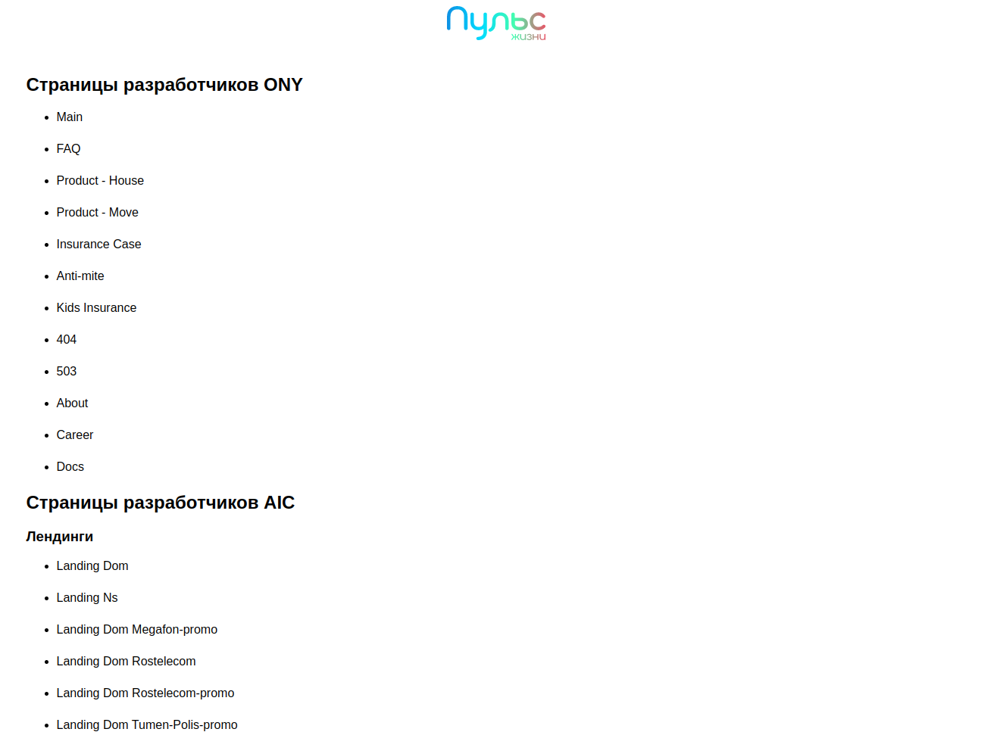

## Используемые технологии в проекте
Данный проект реализован с помощью композиции **Webpack** SASS, JS NATIVE, BEM ClassName, BEMPUG(со временем будет отключен)

### STORE и вспомогательные функции для работы с данными
Каждый STORE состоит из функциональных элементов DATA, BEM, ELEM, OPT, ARR
```
elem: {
	brandParagraphData: {
		data: {
			text: '...'
		},
		bem: {
			color: '...'
		},
		opt: {
			isChildClass: true
		}
	},
```
- DATA - блок с данными, в который передаются данные, такие как текст, url, src к картинкам и т.д.;
- BEM - блок с БЭМ логикой, в который передаются модификаторы, классы;
- ELEM - в данный блок передаются компоненты. У компонента могут быть свои DATA, BEM, ELEM, OPT, ARR;
- OPT - логический блок, принимает параметры, у которых значение может быть либо true, либо false;
- ARR - блок массивов, принимает в себя блоки кода/компоненты, которые необходимо итерировать в цикле. Бывает DATA_ARR и ELEM_ARR.

Для того, чтобы они воспринимались в коде необходимо прокинуть вспомогательные функции при верстке

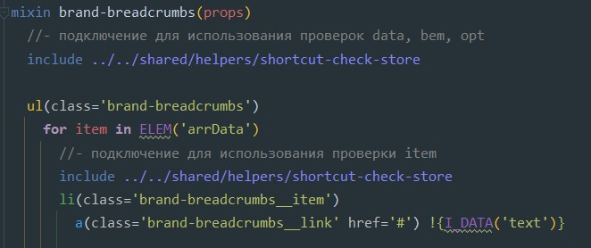

Для работы с массивом данных в сторе используется массив dataArr
```
brandBreadcrumbs: {
	elem: {
		dataArr: [
			{
				data: {
					text: 'Главная'
				}
			},
			{
				data: {
					text: 'Новости'
				}
```
И для доступа к его внутренним элементам к функциональным элементам **I_**(I_DATA, I_BEM...)


## Создание компонентов

### Верстка компонента(../components)
- components-compose(Одиночные компоненты, которые также могут использоваться в компонентах ui)
- components-ui(Сложные составные компоненты)

Работа с данными в компоненте происходит путем передачи данных стора в виде **props**!

Размещение компонента производится в каталоге ../components или ../components-new. Название каталога с файлами компонента должно совкадать с названием самого компонента.
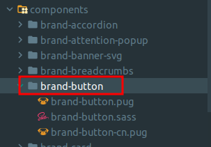

Классы в компоненте создаются в файле ...-cn.pug по методологии bem-className от компании Яндекс (https://ru.bem.info/technologies/bem-react/classname/). 
Модификаторы к классу задаются в { }, дополнительные классы задаются в [ ].

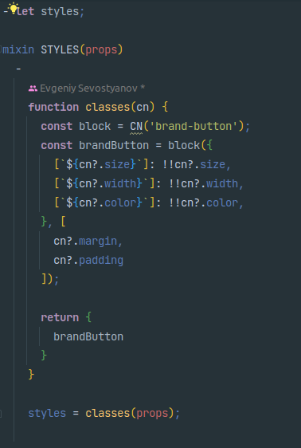

Далее миксин STYLES подключается к компоненту и используется в определении классов в версте


Любой компонент состоит из файла pug, ...-cn.pug и sass/scss

Верстка компонента делается в файлах pug и ...-cn.pug. 

### Подключение компонентов

После создания компонента необходимо подключить:
1. pug файл(../components/components.pug)

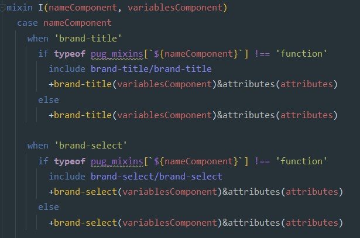
2. sass файл(../components/components.sass)

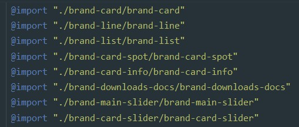
3. После этого данный компонент может использоваться в верстке секции

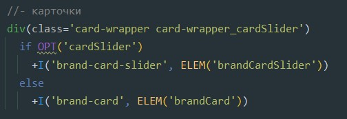
4. В конце он добавляется на страницу, где будет использоваться

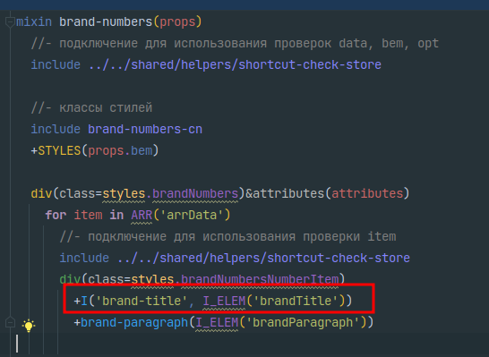


В 2023 году в проекте была принята новая дизайн система, которая потребовала разработки новых компонентов. 
В результате компоненты проекта разделились на два каталога: components и components-new.
Компоненты под новую дизайн систему размещаются а каталоге components-new.

## Создание секции

### Верстка секции(../sections)

Работа с данными в секции происходит путем передачи данных стора в виде **props**!

Верстка секции происходит в форме mixin, в котором используются компоненты и pug элементы. Пример секции:

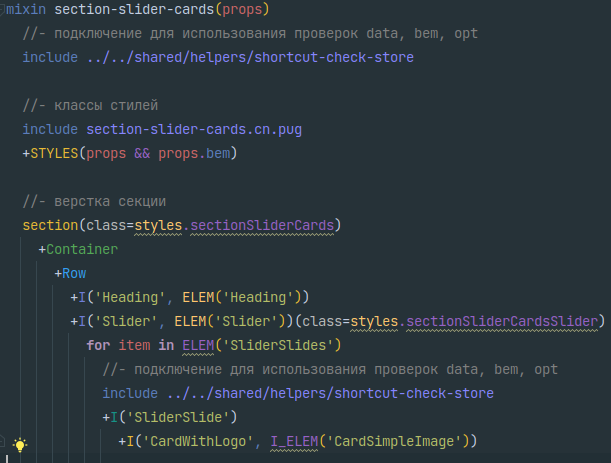

Любая секция состоит из файла pug, ...-cn.pug и sass
1. Классы для секции задаются в ...-cn.pug секции, которые потом в неё подключаются (подключение аналогично подключению в компоненте)
2. Стили секции описываются в sass файле
3. Верстка секции в основном pug файле.
4. После этого стили секции нужно подключить в основной файл стилей всех секций(section.sass)

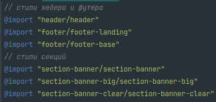
5. Затем сама секция подключается на страницу, где используется

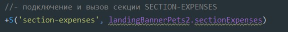

## Создание страницы

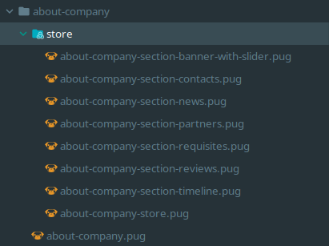
- Основной файл (например about-company.pug)
1. В нем подключаются layout для страницы

2. Собирается общий store, состоящий из сторов секций(внутри файла стора секции находятся данные, которые используются для верстки секций)

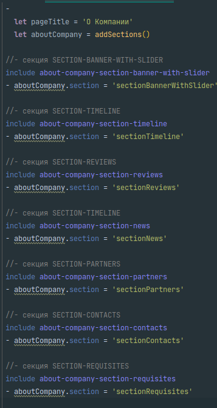
3. В pug файле страницы подключается общий стор страницы

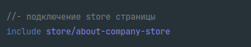
4. Ниже подключаются секции используемые на странице

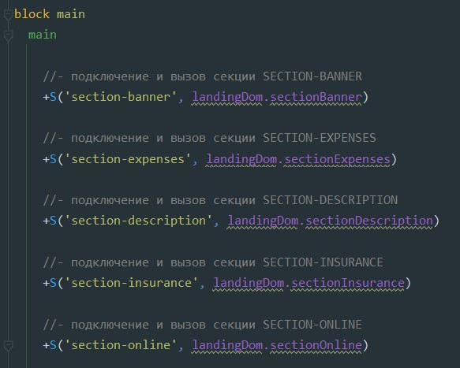

### Создание js файлов(../js-modules)
1. При создании используется модульная(экспорт-импорт) система
2. После чего js-файл подключается и вызывается в main.js

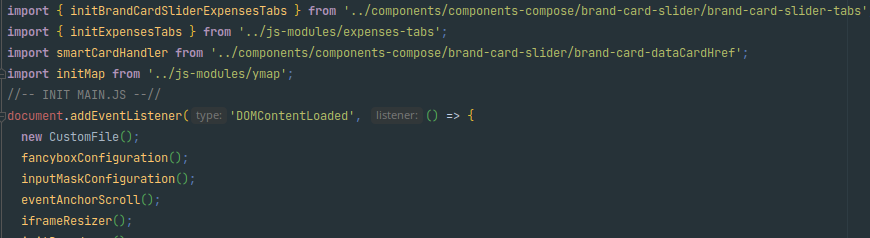

## NPM
```bash
# install dependencies
$ npm install

# serve with hot reload at localhost:3000
$ npm start
# build for production to /build
$ npm run build

# watch for changes and deploy it to server (from ./accesses)
$ npm run server
```

## Работа с репозиторием и ветками
Основной репозиторий разбит на:
+ Frontend(После сборки - папка build)
+ Backend(Заменяется содержимым из папки Frontend/build)

### Инструкция по работе с git проекта

**1.** Всю работу начинаем с ветки **'master'** с последующим ответвлением от неё.
`(git checkout master)`

**2.** В первую очередь надо проверить актуальность ветки **'master'** и вслучае не актуальности подтянуть из удаленного репозитория.
`(git status; git pull)`

**3.** Когда задача (таска) берется в работу всегда необходимо всегда ответвляться от ветки **'master'**.
`(git checkout -b <name branch>)`

**4.** Под каждую задачу создаешь отдельную ветку именуя номером задачи из таска и словами описывающими заголовок из таска на английском. *Пример: 'Task-36991-130-no-scroll'*.
`(git checkout -b Task-36991-130-no-scroll)`

**5.** По завершению выполнения задачи обязательно надо создать merge request с задачей в ветку **'revision'**.
`(отправляем merge request в GitLab`)

**6.** После тестирования и проверки *задачи* на **revision** ветке необходимо смерджить **ветку Revision** в ветку **master** `(отправляем merge request в GitLab`)`


## sass-lint
sass-lint работает по схеме
- Box
  - Блок включает в себя любое свойство, влияющее на отображение и положение блока
  - К примеру: display, float, position, left, top, height, width
- Border
  - Все что связанно с бордером
  - border, border-image, border-radius и т.д.
- Background
  - Все что связанно с фоном
  - Пример background, background-color, background-image, background-size
- Text
  - Пример font-family, font-size, text-transform, letter-spacing
- Other
  - Все остальное

## Работа с ветками для gitlab-pages
- Ответвляемся от ветки `master` для реализации рабочей таски по ТЗ.
- Называем ветку в соответствие с задачей из ActiveCollabe. Пример `Task-50553-444-xxxx-xx-x`
- После реализации задачи переносим рабочую ветку на `develop` и пушим.
- Билдим ветку `develop` и переносим билд в одноименную папку названную с веткой - `develop`.
- Отдаем на проверку менеджеру/дизайнеру/тестировщику.
- После проверки и успешно выполненной задачи переносим рабочую ветку с задачей на ветку `pre-production` и пушим.
- Билдим ветку `pre-production` и переносим билд в одноименную папку названную с веткой - `pre-production`.
- Отдаем бекенд разработчику для переноса на его тестовый стенд, чтобы показать заказчику перед переносом в ветку `master`.
- После тестирования на тестовом стенде у бекенда переносим переносим рабочую ветку с задачей на ветку `master` пушим и удаляем рабочую ветку.
- **Обязательно по всем стадиям пишем в ActiveCollabe и предоставляем ссылки на коммиты и front-end страницы из gilab-pages.**
